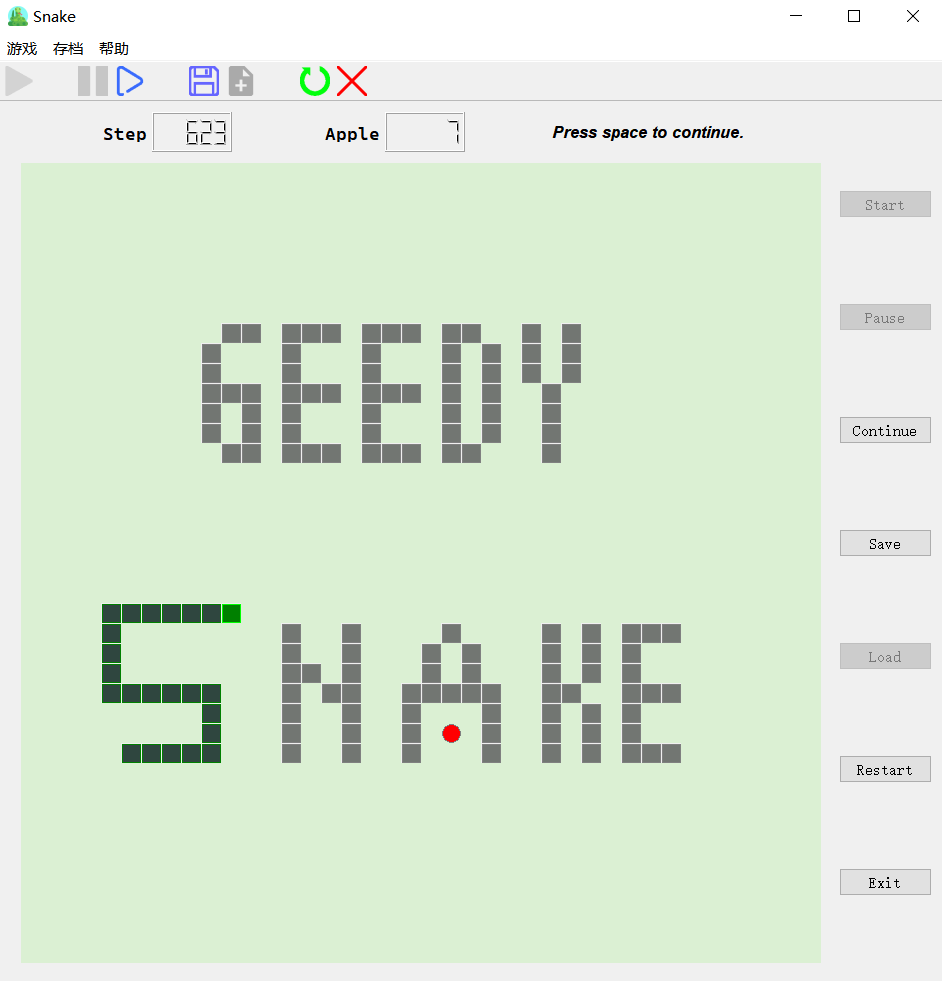
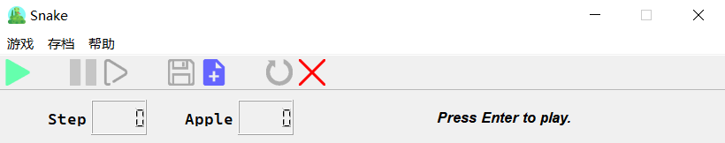

<font face="宋体">

<h1><center>Qt贪吃蛇大作业设计文档</center></h1>

<p align="right">计95 刘玉河 2019011560</p>

---

<center></center>

<center>游戏主界面</center>

<div style="page-break-after: always;"></div>

## 界面与功能展示

<center></center>

<center>从上至下：菜单栏、工具栏、状态栏</center>

---

<center></center>

<center>菜单栏”游戏““存档”“帮助”选项卡</center>

---

<center></center>

<center>帮助窗口 与 关于窗口</center>

---

<center></center>

<center>保存窗口 与 载入存档窗口</center>

---

<center></center>

<center>游戏网格（左：未开始；右：游戏中）</center>

---

<center></center>

<center>游戏结束提示</center>

---

<div style="page-break-after: always;"></div>

## 程序架构

### 主要类：

- #### GameWindow : public QMainWindow：负责游戏主界面布置、游戏流程控制

    ```cpp
    // 主要成员函数与数据成员
    public slots:
        void gameStatusChange(int);	// 状态切换
        void playStep();			// 游戏动作
        void playStart();			//   |
        ...
        void playLaunch();			// 游戏动作
        void snakeGrow();			// 处理蛇成长动作
        void saveGame();			// 存档写入
        void loadGame();			// 存档读取
    signals:
        void actionTriggered(int);	// 控制UI功能开启/关闭
        void direcInput(int);		// 控制蛇转向信息
        void snakeMove();			// 发射蛇前进信号
        void snakeRetract();		// 发射蛇收尾信号
    private:
        Ui::GameWindow *ui;
        // 读取键盘输入
        void keyPressEvent(QKeyEvent *ev) override;
    	// 初始化
        void init();
        // 状态信息
        int m_mainStatus;
        // 主要类成员
        QTimer* playTimer;
        board* gameboard;
        Snake* snake;
    ```

- #### Snake : public QObject  ： 记录贪吃蛇信息（身体位置、成长状态、方向）、处理相关功能（转向、头前进、尾部收缩）

    ```cpp
    public:
        int len() const {return body.length();}			// getter
        int dir() const {return m_dir;}
        int grow() const {return m_grow;}
        QList<QPoint> getSnake() const {return body;}
    signals:
        void snakeMoved(QPoint,QPoint);					// 发送给board处理蛇移动信息
        void snakeRetracted(QPoint);
    public slots:
        void retract();									// 接收来自GameWindow的指令信息
        void move();
        void setgrow(int);
        void chgDirection(int,bool forced = false);
    private:
        QList<QPoint> body;								// 私有成员记录信息
        int m_dir;	// 0右 1下 2左 3上
        int m_grow;	// >0:成长中  =0:未成长
        bool dirChanged;
    ```

- #### Board : public QFrame： 记录格局状态、生成苹果、判断碰撞

    ```cpp
    public:
        explicit board(QWidget *parent = nullptr);
        Cell* getCell(int i,int j) const {return cells[i][j];}
    signals:
        void chgCellStatus(QPoint,int);					// 发送给cell处理网格更新
        void hit();										// 返回碰撞信号
        void appleEaten();								// 返回吃苹果信号
    public slots:
        void SnakeMoved(QPoint preH,QPoint tryH);		// 接收来自Snake的移动信息，判断碰撞
        void SnakeRetracted(QPoint);
        void flush();									// 清空布局
        void genApple();								// 生成苹果
    private:
        QGridLayout *layout;
        Cell *cells[SIZE][SIZE];						// 网格数组成员
    ```

- #### Cell : public QPushButton：记录单个网格状态，绘制网格图案

    ```cpp
    public:
        explicit Cell(int s, QPoint pos, QWidget *parent = nullptr);
        cellStatus getStatus() const {return m_status;};
    public slots:
        void changeCellStatus(QPoint,int);				// 接收来自board的状态更新信息
        void handleClick();								// 未开始状态下空白/障碍的切换
        void setBlankStyle(bool);						// 未开始/游戏状态 空白网格的不同显示
    private:
        void paintEvent(QPaintEvent *) override;		// 绘图函数
        cellStatus m_status;
        QPoint m_pos;									// 记录所在位置信息
        int m_style;
    ```

<div style="page-break-after: always;"></div>

### 辅助头文件 utils.h

```cpp
#include <QPoint>
const int SIZE = 40;
QPoint const direct[4] = {QPoint(0,1),QPoint(1,0),QPoint(0,-1),QPoint(-1,0)};   // 0右 1下 2左 3上
// 0右 1下 2左 3上
enum cellStatus{						// 网格状态
    blank, block, snake_body, snake_head, apple
};
const int status_map[4][6] = {			// 建立游戏状态与UI按钮开闭状态之间的映射
    {0,1,1,1,1,0},  // 0 未开始状态
    {1,0,1,1,1,1},  // 1 游戏状态
    {1,1,0,0,0,1},  // 2 暂停状态
    {1,1,1,0,1,1}   // 3 终止状态
};
```

### 信号/槽 连接情况：

| sender(类或实例)          | SIGNAL                    | receiver(类或实例) | SLOT                                           |
| ------------------------- | ------------------------- | ------------------ | ---------------------------------------------- |
| ui->actionStart/Pause/... | triggered()               | GameWindow         | \[=\](){emit actionTriggered();...相关指令...} |
| GameWindow                | actionTriggered(int)      | GameWindow         | gameStatusChange(int)                          |
| GameWindow                | direcInput(int)           | Snake              | chgDirection(int)                              |
| GameWindow                | snakeMove()               | Snake              | move()                                         |
| GameWindow                | snakeRetract()            | Snake              | retract()                                      |
| Board                     | appleEaten()              | GameWindow         | snakeGrow()                                    |
| Board                     | hit()                     | GameWindow         | playEnd()                                      |
| Snake                     | snakeMoved(QPoint,QPoint) | Board              | SnakeMoved(QPoint,QPoint)                      |
| Snake                     | snakeRetracted(QPoint)    | Board              | SnakeRetracted(QPoint)                         |
| Board                     | chgCellStatus(QPoint,int) | Cell               | changeCellStatus(QPoint,int)                   |
| QTimer                    | timeoff()                 | GameWindow         | playStep()                                     |

<div style="page-break-after: always;"></div>

## 功能实现与设计思路

### 主要类之间的关系


### 游戏流程实现

设置计时器QTimer

- 在playStart、playContinue时开始
- 在playPause、playEnd时停止。

将计时器timeoff()信号与GameWindow的playStep()连接，控制游戏进程的步进

```cpp
playTimer = new QTimer(this);
playTimer->setInterval(100);
connect(playTimer,SIGNAL(timeout()),this,SLOT(playStep()));
```

<div style="page-break-after: always;"></div>

### 贪吃蛇的相关功能实现

- 数据结构

    利用Qt自带的QList及QPoint建立数据为点QPoint的列表QList\<QPoint\>  snake

    - 前进时将新的头部点推入列表尾部(push_back)

    - 收缩时将尾部点从列表头部推出(pop_front)

- 前进Move

    ```cpp
    void Snake::move()
    {
        QPoint head = body.back();			// 从链表末尾中获取蛇的头部
        QPoint next = head + direct[m_dir];	// 根据当前方向m_dir确定头部下一位置
        body.push_back(next);				// 将新位置推入链表
        dirChanged = 0;						// 更新方向改变状态，允许新的方向输入
        emit snakeMoved(head,next);			// 向gameBoard发射头部移动信号
    }
    void board::SnakeMoved(QPoint preH,QPoint tryH)	// preH为原先头部位置，tryH为下一头部位置
    {
        int x = tryH.x(),y = tryH.y();
        if( x < 0 || x >=SIZE || y < 0 || y >= SIZE){	// 判断边界
            emit hit();
            return;
        }
        cellStatus cell = cells[x][y]->getStatus();	// 获取网格位置
        switch(cell){						// board 根据网格状态决定前进结果
        case blank:{emit chgCellStatus(preH,2);emit chgCellStatus(tryH,3);break;}	// 空白网格，移动成功
        case block:{emit hit();;break;}												// 障碍/蛇头/蛇身，移动失败
        case snake_body:{emit hit();break;}
        case snake_head:{emit hit();break;}
        case apple:{emit chgCellStatus(preH,2);emit chgCellStatus(tryH,3);emit appleEaten();break;}
                																	// 苹果，蛇成长
        }
    }
    ```

- 收缩Retract

    ```cpp
    void Snake::retract()
    {
        QPoint tail = body.front();
        body.pop_front();					// 将原有尾部推出链表
        emit snakeRetracted(tail);			// 发射尾部收缩信号
    }
    ```

- 改变方向

    ```cpp
    void Snake::chgDirection(int dir,bool forced) {
        if(forced){			// 用于载入存档时强制调整方向
            m_dir = dir;
            return;
        }
        if(((m_dir + dir)%2) && !dirChanged)	// 代码逻辑见下方说明
        {
            m_dir = dir;
            dirChanged = 1;
        }
    }
    ```

    在方向改变功能上，主要有两个问题：1. 输入与当前方向相同或相反方向的处理，以及 2. 在蛇前进前连续改变方向的处理

    1. 考虑到上下左右分为垂直、水平两组，联想到模2操作，于是将四个方向按照垂直为奇数，水平为偶数来分配序号：

        0右 1下 2左 3右

        将 原来的方向 与 试图改变的方向 **序号相加**后模2，若为奇数则可以改变，偶数则忽略，便解决了第一个问题。

    2. 设立dirChanged私有布尔变量，方向改变时将其设为真，当其为真时忽略接下来的任何方向改变，直到蛇前进后将其重设为假，允许新的方向改变。

<div style="page-break-after: always;"></div>

### 额外功能

- 音效：在改变方向时依照所改变的方向播放钢琴音符re,mi,sol,la

    ```cpp
    switch (dir) {
            case 0:re.stop();re.play();break;	// 在播放前先停止正在播放仍未结束的原音符
            case 1:mi.stop();mi.play();break;
            case 2:sol.stop();sol.play();break;
            case 3:la.stop();la.play();break;
    }
    ```

- 速度改变：按下逗号/句号键可以减慢/加快速度

    ```cpp
    if(ev->key() == Qt::Key_Comma) chgSpeed(1.2);
    if(ev->key() == Qt::Key_Period) chgSpeed(0.8);
    ```

- 帮助文档与游戏信息

    新建了Help与About类，分别包含"帮助"窗口与"关于"窗口

## 心得体会

在本次大作业设计过程中，首先充分体会到了Qt的信号/槽机制以及事件机制的强大，信号/槽机制能够使不同的对象之间有了简单的沟通渠道，而事件机制则提供了很方便的用户交互的解决方案。其次，由于第一次写程序大作业，在面向对象编程方面并不熟练，很多时候是为了OOP而OOP，最后导致几个类之间的关系比较庞杂，多了许多冗余的接口，可以期望后续继续改进该程序的架构，并增设和完善更多功能。

</font>